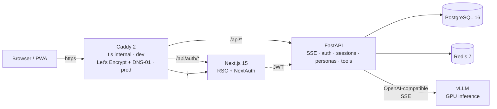
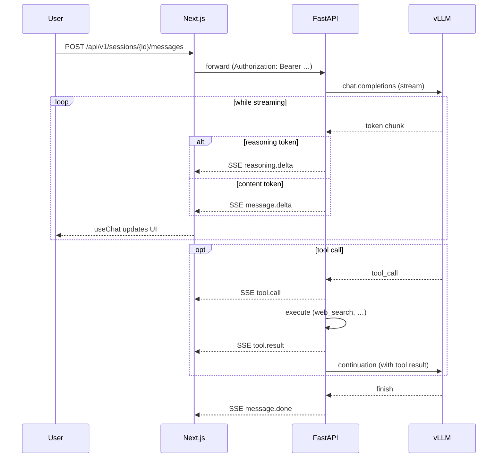

<div align="center">

# 🪷 Axolotl Companion

**Local-first AI companion** with a private LLM, a streaming chat UI, and an animated mascot.

[](LICENSE)
[](https://www.python.org/)
[](https://www.typescriptlang.org/)
[](https://caddyserver.com/)
[](https://letsencrypt.org/)

</div>

---

## ✨ Features

> ✅ shipped &nbsp;·&nbsp; 🚧 in progress &nbsp;·&nbsp; 📋 planned

- ✅ **Private LLM inference** — [vLLM](https://github.com/vllm-project/vllm) in Docker on your own GPU, model configurable via env vars (any vLLM-compatible repo).
- ✅ **Streaming chat** — SSE pipeline emits `reasoning.delta`, `message.delta`, `tool.call`, `tool.result` events; the UI renders reasoning blocks, web-search result cards and tool-call traces in real time.
- ✅ **Tool calling** — extensible built-in registry (`web_search` shipped, per-user toggle) **plus full MCP support**: per-user MCP servers with Fernet-encrypted bearer tokens, manual sync, automatic tool-name namespacing, and dedicated chat cards for MCP results.
- ✅ **Personas** — named system prompts with full markdown bodies, default-per-user pin, per-session attach via the command palette.
- ✅ **Granular controls** — global hyperparam defaults on the user (temperature, top_p, top_k, min_p, presence_penalty, repetition_penalty, max_tokens, `enable_thinking`), overridable per-session from a `Cmd+,` drawer.
- ✅ **Auth** — Auth.js v5 (credentials provider) → FastAPI JWT, bcrypt hashes, rotating refresh tokens, **slowapi per-IP rate limiting** on the auth endpoints.
- ✅ **Custom design language** — pixel-neubru (warm cream paper, 2 px ink borders, electric-lime accent), dark/light theming, command palette (`Cmd+K`), keyboard-shortcut overlay.
- ✅ **3D animated mascot** — Blender-baked GLB with seven NLA clips (idle / listening / thinking / searching / typing / happy / confused), driven by Three.js with a 300 ms mood crossfade and pixel-art emblem overlays. SVG sprite is the SSR + reduced-motion fallback.
- ✅ **Installable PWA** — Serwist service worker with NetworkOnly bypass on `/api/*` and on every navigation (post-rebuild redirect loops impossible).
- ✅ **i18n FR / EN** — `next-intl` with cookie-based locale (no URL prefix), ICU plurals, locale-aware relative time. Sidebar switcher pinned next to the theme toggle.
- ✅ **Real HTTPS, opt-in** — public hostname served with a Let's Encrypt cert via the **DNS-01** challenge (Cloudflare DNS plugin) — works behind NAT, no public IP, no port forwarding, no client-side CA install.
- ✅ **Observability** — Prometheus + Grafana profile (`make obs`) with a provisioned dashboard for HTTP latency / chat streams / tool-call outcomes / vLLM KV-cache; **Langfuse** trace exporter wires every chat round + tool call into a hosted timeline when credentials are set.
- ✅ **OpenAPI → TS types pipeline** — backend schema is the single source of truth; frontend types are regenerated, drift is enforced in CI.
- 📋 **Export / import conversations** (JSON) is the last polish item left on the roadmap.

## 🏗️ Stack

| Layer | Tech |
|---|---|
| LLM serving | **vLLM** (Docker, GPU), model configurable via `VLLM_MODEL` |
| Backend | **FastAPI** · Python 3.12 · **SQLModel** + Alembic · Pydantic v2 · structlog · uv |
| LLM client | OpenAI-compatible HTTP, SSE streaming, tool-calling rounds |
| Frontend | **Next.js 15** (App Router, RSC) · React 19 · TS strict · **Tailwind v4** · Radix UI · TanStack Query · Zod · Auth.js v5 |
| Data | **PostgreSQL 16** (citext, pgcrypto, pg_trgm) · **Redis 7** |
| Reverse proxy | **Caddy 2** (custom build with `caddy-dns/cloudflare` for DNS-01) |
| Orchestration | Docker Compose · `make`-driven workflows |
| Quality | Ruff · mypy strict · ESLint · `tsc --noEmit` · pytest · vitest · playwright |

## 🚀 Quick start

### Prerequisites

- NVIDIA GPU with enough VRAM for the model you plan to load
- Docker + NVIDIA Container Toolkit
- Linux or WSL2

### Launch

```bash
git clone <this-repo>
cd axolotl-companion
cp .env.example .env
# Edit .env: set HF_TOKEN, JWT_SECRET, FERNET_KEY, AUTH_SECRET, your model
make dev
```

Then open <https://chat.localhost> (Caddy serves a self-signed cert in dev — accept once).

### Configuring the model

Any vLLM-compatible model works. Edit `VLLM_MODEL` in `.env` (HuggingFace repo id or local path) plus the related knobs:

- Context window (`VLLM_MAX_MODEL_LEN`)
- KV cache dtype (`VLLM_KV_CACHE_DTYPE` — `fp8` / `auto`)
- Concurrent sequences (`VLLM_MAX_NUM_SEQS`)
- GPU memory utilisation (`VLLM_GPU_MEMORY_UTILIZATION`)
- Quantization passthrough (`VLLM_QUANTIZATION` — AWQ / GPTQ / NVFP4 / FP8)

See [`docs/models.md`](docs/models.md) for recommended profiles by GPU budget.

### Make targets

```bash
make dev              # Build + start the full stack with HMR
make prod             # Build + start with the prod overrides
make test             # Backend pytest + frontend vitest + e2e
make lint             # Lint + type-check both sides
make db-migrate       # Run pending Alembic migrations
make backup           # Snapshot the Postgres DB to ./backups/
make obs              # Add Prometheus + Grafana + Langfuse on top
make clean            # Stop + remove containers AND volumes (destructive)
```

## 🌐 Remote access (optional)

Out of the box, the stack only listens on `chat.localhost` from the host. To expose it to other devices on your Wi-Fi (or to your phone), point a public DNS A record at the host's LAN IP and let Caddy obtain a real Let's Encrypt cert via the **DNS-01** challenge — no NAT traversal, no port forwarding, no homemade CA install on the client.

Full walk-through in [`docs/deployment.md`](docs/deployment.md), including the optional Cloudflare Tunnel path for Internet-wide demo access.

TL;DR — set `APP_HOSTNAMES` and `CF_API_TOKEN` (Cloudflare DNS Zone:Edit) in `.env`, point an A record at your LAN IP in the Cloudflare dashboard (DNS-only, gray cloud), and `make dev` does the rest.

## 📚 Documentation

The repo ships with a structured docs tree under [`docs/`](docs/):

| File | Covers |
|---|---|
| [`docs/architecture.md`](docs/architecture.md) | Services, request routing, code layout |
| [`docs/auth.md`](docs/auth.md) | Auth.js v5 ↔ FastAPI JWT, refresh rotation, cookies |
| [`docs/database.md`](docs/database.md) | Postgres schema table-by-table, indexes, FK behaviour |
| [`docs/api.md`](docs/api.md) | REST + SSE reference with curl examples |
| [`docs/chat.md`](docs/chat.md) | Streaming chat pipeline, tool calling, reasoning |
| [`docs/features.md`](docs/features.md) | Personas, layered hyperparams, palette, drawer, tools |
| [`docs/deployment.md`](docs/deployment.md) | Local dev → public HTTPS → Cloudflare Tunnel |
| [`docs/models.md`](docs/models.md) | vLLM tuning per GPU tier |
| [`docs/adr/`](docs/adr/) | Architectural decision records |

## 📂 Repo layout

```
axolotl-companion/
├── backend/                 FastAPI + SQLModel + Alembic + uv
│   ├── src/axolotl/         FastAPI app: api/, db/, llm/, schemas/, services/
│   └── alembic/             Migrations
├── frontend/                Next.js 15 + Auth.js v5
│   └── src/
│       ├── app/             App Router routes (login, register, home, chat, settings)
│       ├── components/      chat/, hyperparams/, layout/, palette/, settings/, ui/
│       ├── hooks/           useApi, useChat
│       └── types/           API types (auto-generated from OpenAPI)
├── docker/
│   ├── proxy/               Caddy custom build (DNS-01 plugin)
│   └── vllm.Dockerfile
├── compose.yaml             Base Compose (dev-friendly, HMR)
├── compose.prod.yaml        Production overrides
├── docs/                    Reference docs (architecture, auth, database, api, chat, features, deployment, models) + ADRs
└── Makefile                 Unified workflow targets
```

## 🗺️ Architecture

### Request routing



The `/api/*` split is same-origin, so the Next.js bundle uses a relative `NEXT_PUBLIC_API_URL=/api` and the **same build** serves any entry point (`chat.localhost`, public hostname, LAN IP) without per-deployment rebuilds.

### Streaming chat flow



## 🛣️ Roadmap

Full phased roadmap in [`plan.md`](plan.md). Current state:

- Phase 0 — Repo setup ✅
- Phase 1 — Backend MVP ✅ (auth, sessions, chat SSE, tool calling, personas, MCP)
- Phase 2 — Frontend MVP ✅
- Phase 3 — Animated axolotl ✅ (Three.js + GLB + seven-state derivation)
- Phase 4 — Polish 🚧 (PWA ✅, MCP ✅, i18n ✅, mobile ✅, public HTTPS ✅ — export/import still pending)
- Phase 5 — Observability ✅ Prometheus + Grafana board + Langfuse traces · security checklist 9/10

## 📄 License

MIT — see [LICENSE](LICENSE).
