# ADR-003 — Authentication strategy

**Status** : Accepted
**Date** : 2026-04

## Context

We need authentication that:
- Works with Auth.js v5 on the frontend
- Lets FastAPI authorize each API call independently
- Supports session persistence and refresh
- Keeps secrets out of client JavaScript

## Decision

**Two-layer auth: Auth.js v5 (frontend session) + FastAPI JWT (backend authorization).**

```mermaid
flowchart TD
    Browser[Browser<br/>Auth.js session cookie · HttpOnly · SameSite=Lax<br/>stores: user id + access_token JWT + refresh token]
    Next[Next.js<br/>RSC / route handler<br/>reads session via auth&#40;&#41;]
    FastAPI[FastAPI /v1/*<br/>verifies JWT signature + expiry]
    DB[(PostgreSQL)]

    Browser -->|cookie| Next
    Next -->|Authorization: Bearer …| FastAPI
    FastAPI --> DB
```

### Flow details

**Register**
1. Next.js form POSTs to FastAPI `/auth/register`
2. FastAPI hashes password with bcrypt, inserts user
3. Returns user (without password)

**Login**
1. Auth.js credentials provider's `authorize()` calls FastAPI `/auth/login`
2. FastAPI verifies password, issues short-lived access JWT (15 min) + refresh token (30 days)
3. Auth.js stores both in an encrypted session cookie (`AUTH_SECRET`-derived)
4. Client never sees raw JWTs in localStorage

**Authorized request**
1. Next.js server component or route handler reads session via `auth()`
2. Forwards `Authorization: Bearer <access_token>` to FastAPI
3. FastAPI dependency `get_current_user` validates signature + expiry
4. If expired, client triggers refresh via `/auth/refresh`

**Refresh**
1. Refresh token is hashed and stored in DB (not raw)
2. On `/auth/refresh`, FastAPI rotates the refresh token (old one marked revoked)

**Logout**
1. Auth.js clears the session cookie
2. Next.js calls FastAPI `/auth/logout` to revoke the refresh token server-side

## Consequences

- FastAPI is stateless for access tokens (pure signature verification)
- Refresh tokens are stateful (stored + revocable) → can implement per-device sessions
- Rotating refresh tokens prevent replay attacks
- Session cookie is HttpOnly + SameSite=Lax → no XSS token theft

## Alternatives rejected

- **Pure cookie-based session** (no JWT backend) — harder for the backend to
  stay stateless and be called from non-Next clients later
- **OAuth-only** — adds external dependencies and complicates local dev
- **Auth.js JWT session with custom backend callback** — works but ties the
  refresh lifecycle to Next.js middleware
