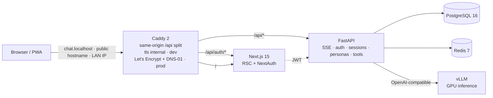

# Architecture

Six services orchestrated by a single `compose.yaml`, fronted by Caddy.
Same-origin routing means the Next.js bundle is built once and served from
any entry point (local, LAN, public hostname).

## Topology



## What each service does

| Service | Role | Image / build | Internal port |
|---|---|---|---|
| `proxy` | Caddy reverse proxy with custom DNS-01 build | `axolotl/proxy` (built from `docker/proxy/Dockerfile`) | 80 / 443 |
| `frontend` | Next.js 15 (App Router, RSC), Auth.js v5, the entire UI | `axolotl/frontend` | 3000 |
| `backend` | FastAPI app: auth, sessions, personas, tools, SSE chat | `axolotl/backend` | 8001 |
| `postgres` | App data, with `citext` / `pgcrypto` / `pg_trgm` extensions | `postgres:16-alpine` | 5432 |
| `redis` | Cache, future rate limiting + TaskIQ broker | `redis:7-alpine` | 6379 |
| `vllm` | LLM inference, OpenAI-compatible API on the GPU | built from `docker/vllm.Dockerfile` | 8000 |

The compose network is `axolotl`; services reach each other by name
(`backend:8001`, `vllm:8000`, etc.). External access goes through Caddy.

## Same-origin `/api` split

Caddy splits a single hostname between Next.js and FastAPI by path:

| Match | Goes to | Why |
|---|---|---|
| `/api/auth/signin`, `/signout`, `/callback/*`, `/session`, `/csrf`, `/providers`, `/error`, `/verify-request`, `/_log` | `frontend:3000` | These are NextAuth's own routes, served from the Next.js app |
| `/api/*` (everything else) | `backend:8001` (with `/api/` stripped) | FastAPI endpoints under `/auth/*`, `/v1/*`, `/health`, `/config` |
| `/` (any other path) | `frontend:3000` | Next.js pages |

The leaf paths between NextAuth (`signin`, `csrf`, `session`, …) and the
backend (`login`, `register`, `refresh`, `logout`, `me`) don't collide, so
the split is unambiguous.

Because both UI and API share the same origin, the frontend bundle uses a
relative `NEXT_PUBLIC_API_URL=/api`. The same build serves
`https://chat.localhost` (dev), `https://axolotl.<your-domain>` (public
HTTPS via DNS-01) and any other entry point you wire up — no per-deployment
rebuild.

## Code layout

```
backend/src/axolotl/
├── api/v1/               FastAPI routers (auth, sessions, personas, tools, config)
├── core/security.py      bcrypt, JWT encode/decode, refresh token hashing
├── db/
│   ├── models.py         SQLModel tables (User, Session, Message, Persona, …)
│   └── migrations/       Alembic
├── llm/
│   ├── client.py         vLLM HTTP client, SSE chat stream
│   ├── orchestrator.py   stream_chat() — the multi-round tool-calling loop
│   ├── tools/            base.py + registry + web_search.py
│   └── events.py         ChatEvent (typed)
├── schemas/              Pydantic DTOs (auth, session, persona, params)
└── services/             settings_store etc.

frontend/src/
├── app/                  App Router routes
│   ├── (auth)/           login, register
│   ├── (app)/            home, chat/[id], settings/*
│   ├── api/auth/         NextAuth handler
│   └── layout.tsx        root layout, theme, Sonner
├── auth.ts / auth.config.ts / middleware.ts
├── components/
│   ├── chat/             ChatWindow, ChatInput, MessageBubble, ChatControlsDrawer
│   ├── hyperparams/      ParamSlider — the DA range slider
│   ├── palette/          CommandPalette
│   ├── settings/         section helpers
│   └── ui/               Modal, ConfirmDialog, Markdown, …
├── hooks/                useApi, useChat
├── lib/                  api.ts (apiFetch), hyperparams.ts (defaults + meta), utils.ts
└── types/                api-generated.ts (OpenAPI → TS) + api.ts (refinements)
```

## Deeper dives

- [`auth.md`](auth.md) — login, refresh, request authorization
- [`database.md`](database.md) — schema reference
- [`api.md`](api.md) — REST + SSE reference with examples
- [`chat.md`](chat.md) — streaming chat pipeline
- [`features.md`](features.md) — personas, layered hyperparams, palette, drawer, tool registry
- [`deployment.md`](deployment.md) — local dev → public HTTPS → Tunnel
- [`models.md`](models.md) — vLLM tuning per GPU
