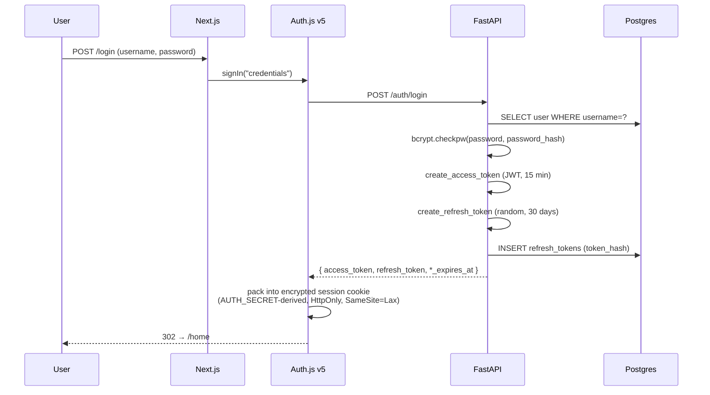
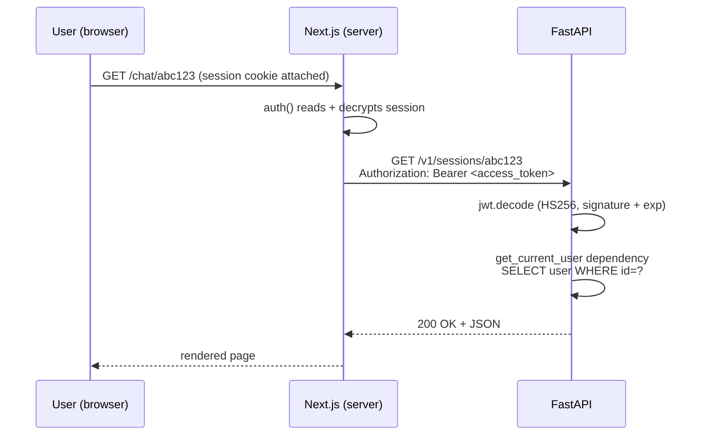
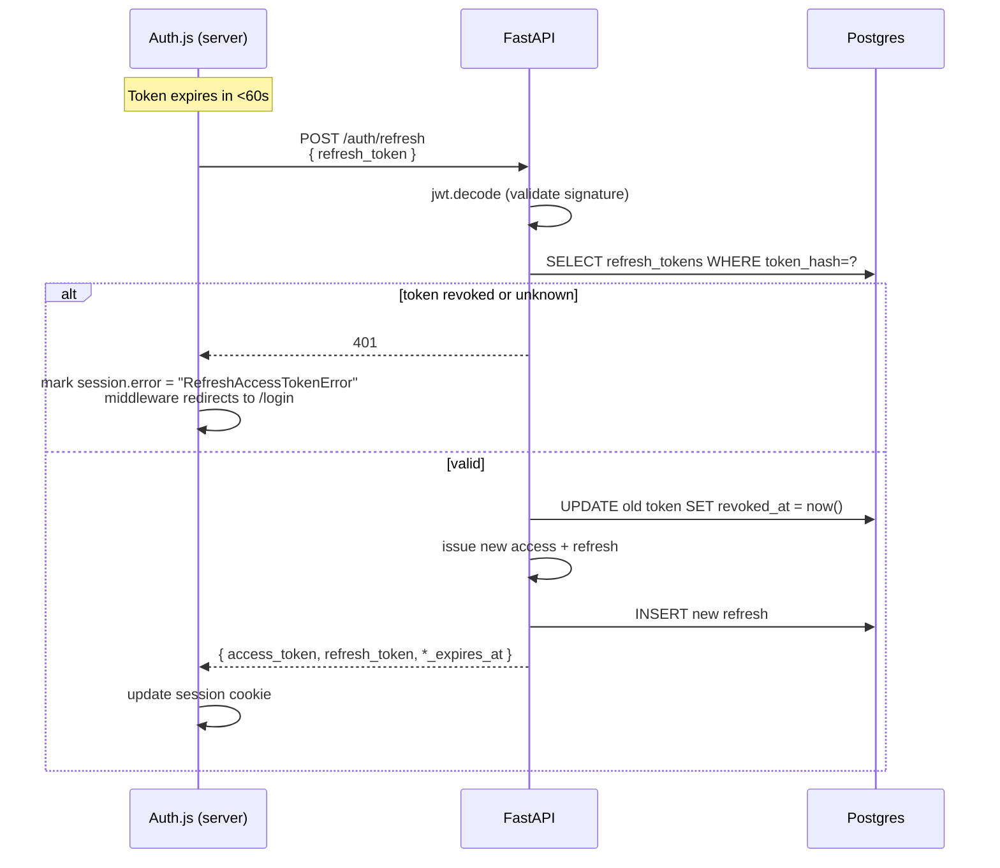

# Authentication

Two layers compose into a single authenticated request:

- **Auth.js v5** on the frontend manages the browser session — the cookie,
  the refresh-on-expiry logic, the `/login` and `/register` form flow.
- **FastAPI** issues short-lived JWTs and stateful refresh tokens, and
  validates the JWT on every protected call.

The split keeps FastAPI stateless on the request path (pure signature
verification, no DB hit) while keeping refresh tokens revocable.

## Login flow



## Authorized request

Every server-side fetch from Next.js to FastAPI rides the access token:



Client-side fetches (e.g. from the chat hook) follow the same shape — the
token is forwarded by the API helper at `frontend/src/hooks/use-api.ts`.

## Refresh

Access tokens last 15 minutes (configurable via `JWT_ACCESS_EXPIRE_MINUTES`).
The Auth.js `jwt` callback in `frontend/src/auth.ts` watches the
`accessTokenExpiresAt` field and refreshes proactively when within 60 s
of expiry:



Every refresh **rotates** the refresh token: the previous one is marked
`revoked_at`. A leaked refresh token is therefore single-use — replaying
it after the legitimate client refreshed will fail.

## Logout

```
Auth.js signOut() → DELETE session cookie
                  → POST /auth/logout (refresh_token)
                  → FastAPI marks the refresh as revoked_at = now()
```

The access token isn't invalidated explicitly — its 15-minute TTL is the
backstop. For higher-stakes deployments, add a JWT blacklist in Redis on
logout.

## Cookie attributes

Auth.js v5 chooses cookie attributes based on whether `AUTH_URL` is HTTPS.
This project always uses HTTPS for any non-`localhost` entry point (Caddy
issues a real cert via DNS-01), so the standard cookie set is:

| Cookie | Flags | Purpose |
|---|---|---|
| `__Secure-authjs.session-token` | `Secure`, `HttpOnly`, `SameSite=Lax`, `Path=/` | Encrypted JWE containing user id + tokens |
| `__Host-authjs.csrf-token` | `Secure`, `HttpOnly`, `SameSite=Lax`, `Path=/` | CSRF double-submit cookie checked on POST `/api/auth/callback/*` |
| `__Secure-authjs.callback-url` | `Secure`, `HttpOnly`, `SameSite=Lax`, `Path=/` | Where to redirect after sign-in |

`AUTH_TRUST_HOST=true` + an explicit `trustHost: true` in `auth.ts` allow
the same bundle to serve multiple origins (chat.localhost, public hostname,
LAN IP) without pinning callbacks to one of them.

## Where the code lives

| Concern | File |
|---|---|
| Auth.js v5 config (server-side, has DB calls) | `frontend/src/auth.ts` |
| Auth.js v5 config (Edge-safe, used by middleware) | `frontend/src/auth.config.ts` |
| Edge middleware that gates protected routes | `frontend/src/middleware.ts` |
| FastAPI auth endpoints | `backend/src/axolotl/api/v1/auth.py` |
| `get_current_user` dependency | `backend/src/axolotl/api/deps.py` |
| JWT encode/decode, bcrypt, refresh hashing | `backend/src/axolotl/core/security.py` |

## Why two layers (and not one)

A pure Auth.js session would work for a Next.js-only app, but it ties
the API to Next as the sole client. A pure FastAPI cookie session would
work for a backend-only app, but it puts session state on every request
and complicates the Auth.js v5 ergonomics.

The two-layer model:

- keeps FastAPI usable from non-Next clients (a future CLI, a mobile
  native app, a webhook integration) — they only need a JWT
- gives the browser a single encrypted cookie that stores both tokens
  (no `localStorage` exposure, no XSS-readable JWT)
- makes refresh token rotation a backend concern (the only thing that
  hits the DB on every refresh)

The full rationale, including alternatives rejected, is recorded in
[`adr/003-auth-strategy.md`](adr/003-auth-strategy.md).
