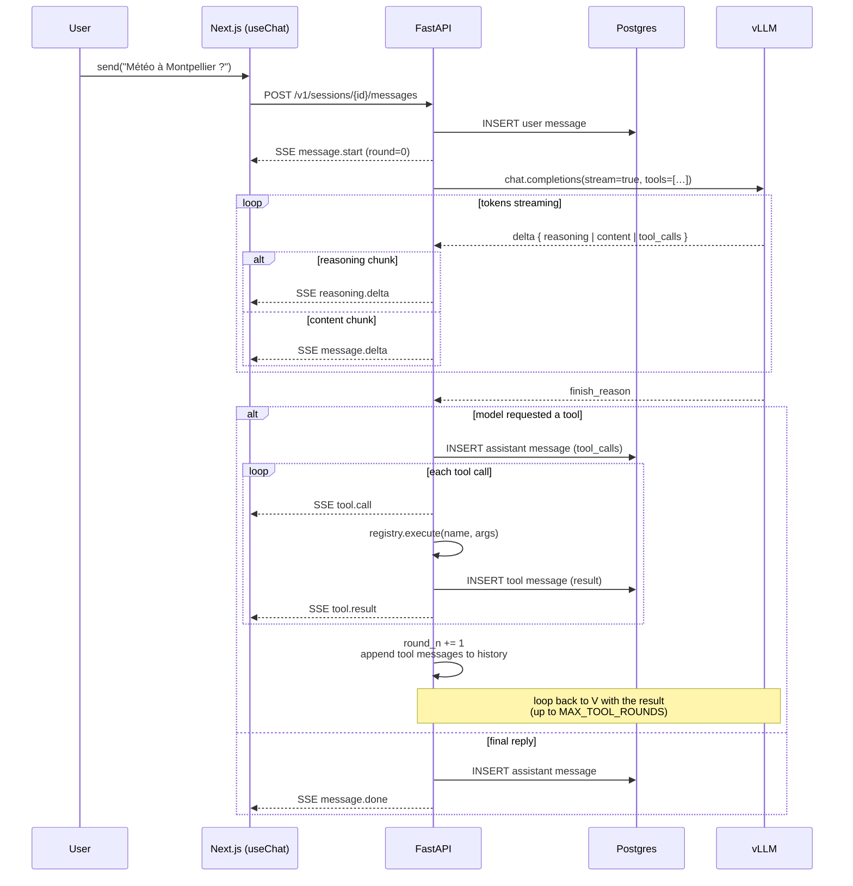

# Streaming chat pipeline

A user message becomes a streamed reply through one orchestration loop
(`stream_chat` in `backend/src/axolotl/llm/orchestrator.py`) that may
take several rounds when the model decides to call tools. The frontend
consumes the SSE stream and incrementally updates a single React state
tree.

## End-to-end sequence



## The orchestrator loop

`stream_chat()` runs at most `settings.max_tool_rounds + 1` rounds. On
the last round, tools are not exposed to the model — that's the cap that
keeps the loop bounded.

```python
for round_n in range(settings.max_tool_rounds + 1):
    is_last_round = round_n == settings.max_tool_rounds
    tools = None if (is_last_round or not tool_specs) else tool_specs

    yield ChatEvent(event="message.start", data={"round": round_n})

    stream = client.stream_chat(
        messages=history,
        model=model,
        tools=tools,
        **sampling,  # merged: settings → user.defaults → session.overrides
    )

    # ... consume deltas, accumulate reasoning/content/tool_calls ...

    if not tool_calls:
        yield ChatEvent(event="message.done", data={...})
        return

    # Tool round: execute each call, persist result, append to history
    for tc in tool_calls:
        result = await execute_tool(tc["function"]["name"], args)
        history.append({"role": "tool", "tool_call_id": tc["id"], "content": result_json})
        yield ChatEvent(event="tool.result", data={...})
    # …loop back, model continues with the tool results in context
```

## Sampling parameters

Three layers stack at the start of every chat (helper:
`_merge_sampling_params`):

| Layer | Source | Storage |
|---|---|---|
| **Base** | `axolotl.config.Settings.vllm_*` | env vars / `.env` (e.g. `VLLM_TEMPERATURE`) |
| **User defaults** | `users.defaults` JSONB | written by `PATCH /auth/me` from the Settings → Model UI |
| **Session overrides** | `sessions.overrides` JSONB | written by `PATCH /v1/sessions/{id}` from the `Cmd+,` controls drawer |

For each of `temperature`, `top_p`, `top_k`, `min_p`, `presence_penalty`,
`repetition_penalty`, `max_tokens`, `enable_thinking`: the topmost layer
that has the key wins. A missing key falls through to the next layer.
The merged dict is spread into the vLLM call.

## Reasoning extraction

vLLM is started with `--reasoning-parser qwen3` (or another family-specific
parser) so the `<think>…</think>` block is returned in a separate
`delta.reasoning` field instead of leaking into `delta.content`. The
orchestrator splits them at the SSE level:

| Backend delta | SSE event |
|---|---|
| `chunk.choices[0].delta.reasoning` | `reasoning.delta` |
| `chunk.choices[0].delta.content` | `message.delta` |

The UI renders the reasoning in a collapsible block above the visible
reply (`StreamingBubble` and `MessageBubble` both support it). On
persistence, `reasoning` and `content` are stored as separate columns on
`messages` so the split survives reloads.

## Tool calling

Each tool extends `axolotl.llm.tools.base.Tool` with:

- `name` (used in OpenAI `function.name`)
- `title`, `description`, `category`, `icon` (UI metadata)
- `parameters_schema` (JSON Schema for the call args)
- `enabled_by_default` (initial state for new users)
- `async run(arguments) -> dict[str, Any]`

A new tool is registered once at module import:

```python
# backend/src/axolotl/llm/tools/get_datetime.py
from axolotl.llm.tools import Tool, registry

class GetDatetime(Tool):
    name = "get_datetime"
    title = "Date & time"
    description = "Return the current date and time."
    category = "utility"
    enabled_by_default = True

    @property
    def parameters_schema(self):
        return {"type": "object", "properties": {}}

    async def run(self, arguments):
        from datetime import datetime, UTC
        return {"now": datetime.now(UTC).isoformat()}

registry.register(GetDatetime())
```

Per-user enable/disable is stored in `settings.tools.enabled` (a JSON
list of names). The orchestrator pulls that list and asks the registry
for the OpenAI specs of just those tools.

## Persistence

The DB schema (`messages` table — see [`database.md`](database.md))
flattens a multi-round turn into multiple rows:

- the assistant row that requested tools has its `tool_calls` JSONB set
  and `content`/`reasoning` may be null
- one `role='tool'` row per call holds the result, keyed by `tool_call_id`
- the next assistant round (post-tool) is another assistant row

For the UI's benefit, `_merge_tool_results` (in
`api/v1/sessions.py`) recombines them on read:

- tool rows are dropped from the public list
- their results are folded into the `tool_calls[].result` of the assistant
  message that requested them
- consecutive assistant messages from the same turn (multi-round
  tool-calling) are coalesced into a single `MessagePublic` so the UI
  renders one bubble per turn

Timing metadata (`round_ms`, `reasoning_ms`, `content_ms`, `total_ms`,
per-tool `duration_ms`) is captured in `messages.metadata` so the bubble
footer can show "thought 1.2s · 240 tok".

## Cancellation

The chat input has a Stop button that aborts the open `EventSource`. On
the backend, `asyncio.CancelledError` propagates into `stream_chat` —
the `client.stream_chat` async-generator's `__aexit__` closes the httpx
stream, which makes vLLM detect the closed connection and stop
generating. The half-finished assistant message is persisted with the
content gathered so far so the user keeps it in history.

## Frontend consumption

`frontend/src/hooks/use-chat.ts` opens a `fetch`-based SSE stream
(native `EventSource` doesn't allow `Authorization` headers cleanly) and
parses events into a single `streaming` state object:

```ts
type StreamingAssistant = {
  reasoning: string;          // accumulated reasoning.delta
  content: string;            // accumulated message.delta
  toolCalls: Record<string, StreamingToolCall>;  // by tool_call_id
  done: boolean;
  startedAt: number;
  elapsedMs: number;
  reasoningStartedAt: number | null;
  reasoningElapsedMs: number;
};
```

When `message.done` arrives, the streaming object is converted to a
final `MessagePublic` and pushed into `messages`. `StreamingBubble` and
`MessageBubble` share the same render path so the visual transition is
seamless.
