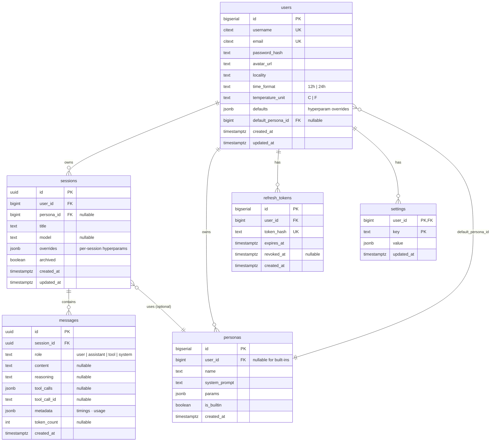

# Database

PostgreSQL 16 with three extensions enabled at init: `citext`,
`pgcrypto`, `pg_trgm`. The schema is owned by SQLModel (typed),
versioned by Alembic, and migrated through `make db-migrate`.

## Schema at a glance



## Tables

### `users`

Account record. One row per registered user.

| Column | Type | Notes |
|---|---|---|
| `id` | `bigserial` PK | |
| `username` | `citext` UK | case-insensitive comparison via the `citext` extension; the unique index is also case-insensitive |
| `email` | `citext` UK | same |
| `password_hash` | `varchar(255)` | bcrypt, handled by `core/security.py`; raw password is never stored |
| `avatar_url` | `varchar(500)` nullable | |
| `locality` | `varchar(80)` nullable | shown in the terminal footer (`● LOCAL · MONTPELLIER`) and resolved to lat/lng for the weather pill |
| `time_format` | `varchar(3)` | `"12h"` or `"24h"`, server default `"24h"` |
| `temperature_unit` | `varchar(1)` | `"C"` or `"F"`, server default `"C"` |
| `defaults` | `jsonb` not null | sparse map of sampling hyperparams (temperature, top_p, …) — the user-level layer in the override stack |
| `default_persona_id` | `bigint` FK → `personas(id)` ON DELETE SET NULL | optional: new sessions adopt this persona when the client doesn't pass `persona_id` |
| `created_at`, `updated_at` | `timestamptz` | |

### `sessions`

A conversation. UUID primary key so client-generated IDs are possible
(useful for offline-first scenarios in the future).

| Column | Type | Notes |
|---|---|---|
| `id` | `uuid` PK | `gen_random_uuid()` default in app code |
| `user_id` | `bigint` FK → `users(id)` | not null, the owner |
| `persona_id` | `bigint` FK → `personas(id)` nullable | session-level persona override |
| `title` | `varchar(200)` | auto-generated from the first user message, manual rename supported |
| `model` | `varchar(100)` nullable | session-level model override (defaults to `VLLM_SERVED_MODEL_NAME`) |
| `overrides` | `jsonb` not null | sparse hyperparam overrides for this session — the top layer in the merge stack |
| `archived` | `boolean` | soft-archive flag for the sidebar list |
| `created_at`, `updated_at` | `timestamptz` | |

Index `ix_sessions_user_updated (user_id, updated_at DESC)` powers the
sidebar's "recent sessions" listing.

### `messages`

One row per logical message in a session. Tool turns are flattened into
multiple rows: an assistant row with `tool_calls` set, then one or more
`role='tool'` rows with the result keyed by `tool_call_id`. The
`_merge_tool_results` helper in `api/v1/sessions.py` recombines them into
public-facing `MessagePublic` for the UI.

| Column | Type | Notes |
|---|---|---|
| `id` | `uuid` PK | |
| `session_id` | `uuid` FK → `sessions(id)` ON DELETE CASCADE | indexed |
| `role` | `varchar(20)` | `"user"` / `"assistant"` / `"tool"` / `"system"` |
| `content` | `text` nullable | the visible message body |
| `reasoning` | `text` nullable | extracted `<think>…</think>` block for assistant messages, stored separately so the UI can render it in a collapsible block |
| `tool_calls` | `jsonb` nullable | OpenAI-format tool-call array for assistant messages that requested tools |
| `tool_call_id` | `varchar(100)` nullable | for `role='tool'` rows: which call this result belongs to |
| `metadata` | `jsonb` not null | timings (`round_ms`, `reasoning_ms`, `content_ms`, `total_ms`) + `usage` (prompt/completion/total tokens) |
| `token_count` | `int` nullable | currently unused; reserved for cheaper retrieval queries |
| `created_at` | `timestamptz` indexed | the per-session ordering key |

### `personas`

Named system prompts. Built-ins have `user_id=NULL` and `is_builtin=true`;
they're visible to every user, but only the owner of a non-builtin can
edit or delete it.

| Column | Type | Notes |
|---|---|---|
| `id` | `bigserial` PK | |
| `user_id` | `bigint` FK → `users(id)` nullable | nullable for built-ins |
| `name` | `varchar(100)` | |
| `system_prompt` | `text` | up to 20 000 chars, markdown bodies allowed |
| `params` | `jsonb` | reserved for future per-persona sampling defaults |
| `is_builtin` | `boolean` | UI shows a 🔒 lock badge and disables edit/delete |
| `created_at` | `timestamptz` | |

The double FK between `users` and `personas` (a user *owns* personas, *and*
optionally pins one as default) means SQLAlchemy can't auto-resolve the
ownership relationship — `User.personas` is annotated with
`foreign_keys="Persona.user_id"` to disambiguate.

### `settings`

Generic key-value store keyed by `(user_id, key)`. Currently used for the
`tools.enabled` JSON list (per-user tool toggles). Future per-user
preferences land here without schema migrations.

| Column | Type | Notes |
|---|---|---|
| `user_id` | `bigint` FK → `users(id)` | composite PK |
| `key` | `varchar(100)` | composite PK |
| `value` | `jsonb` | |
| `updated_at` | `timestamptz` | |

### `refresh_tokens`

Refresh tokens are issued opaque (random 256-bit), stored as a SHA-256
hash, and revoked individually. See [`auth.md`](auth.md#refresh) for the
rotation flow.

| Column | Type | Notes |
|---|---|---|
| `id` | `bigserial` PK | |
| `user_id` | `bigint` FK → `users(id)` | indexed |
| `token_hash` | `varchar(255)` UK | SHA-256 of the raw token |
| `expires_at` | `timestamptz` | |
| `revoked_at` | `timestamptz` nullable | rotation marks the previous token here |
| `created_at` | `timestamptz` | |

## FK behaviour

| FK | ON DELETE | Why |
|---|---|---|
| `messages.session_id → sessions(id)` | CASCADE | deleting a session must drop its history |
| `users.default_persona_id → personas(id)` | SET NULL | deleting a persona shouldn't block deleting a user; the default just clears |
| All other FKs | (default `NO ACTION`) | ORM cascades via SQLAlchemy `cascade="all, delete-orphan"` cover the user → sessions / personas / refresh_tokens / settings deletion path when going through the session API |

> ⚠️ Direct SQL `DELETE FROM users WHERE id=?` will hit FK constraints
> from `refresh_tokens` etc. Use the session API (it routes through the
> ORM cascades) or delete child rows first. A future migration will
> promote ORM-level cascades to DB-level `ON DELETE CASCADE` for the
> ones that should be DB-enforced.

## Indexes that matter

| Index | Column(s) | Why |
|---|---|---|
| `ix_sessions_user_updated` | `(user_id, updated_at DESC)` | sidebar's "recent sessions" query |
| `messages.session_id` | (single col) | listing messages of a session |
| `messages.created_at` | (single col) | ordering within a session, future analytics |
| `users.username`, `users.email` | unique citext | login + duplicate registration check |
| `refresh_tokens.user_id` | | listing / mass-revoking |
| `refresh_tokens.token_hash` | unique | the hot path on `/auth/refresh` |

## Migration conventions

- Migrations live in `backend/src/axolotl/db/migrations/versions/`
- Naming: `<short-hash>_<snake_description>.py` — e.g.
  `f2b8d14c90a3_user_defaults_session_overrides.py`
- Always set explicit `revision` + `down_revision`. Generate stubs with
  `make db-makemigration MSG="..."`, then **manually format with ruff**
  (the autogenerate post-hook is unreliable in ephemeral containers).
- `server_default` on `NOT NULL` JSONB columns is `'{}'::jsonb` so the
  ALTER TABLE doesn't fail on existing rows.

## Useful queries

```sql
-- Recent sessions for a user, newest first (sidebar)
SELECT id, title, model, archived, updated_at
FROM sessions
WHERE user_id = $1 AND archived = false
ORDER BY updated_at DESC
LIMIT 50;

-- All messages for a session, in order
SELECT id, role, content, reasoning, tool_calls, tool_call_id, metadata, created_at
FROM messages
WHERE session_id = $1
ORDER BY created_at;

-- A user's tools.enabled list
SELECT value FROM settings
WHERE user_id = $1 AND key = 'tools.enabled';

-- Active refresh tokens for a user (debug / forced logout)
SELECT id, expires_at, revoked_at, created_at
FROM refresh_tokens
WHERE user_id = $1 AND revoked_at IS NULL AND expires_at > now();
```

`make db-shell` opens a `psql` session for ad-hoc inspection.
