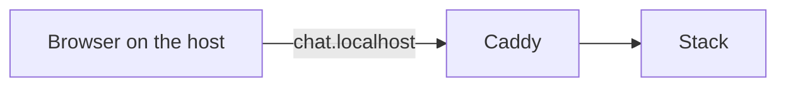
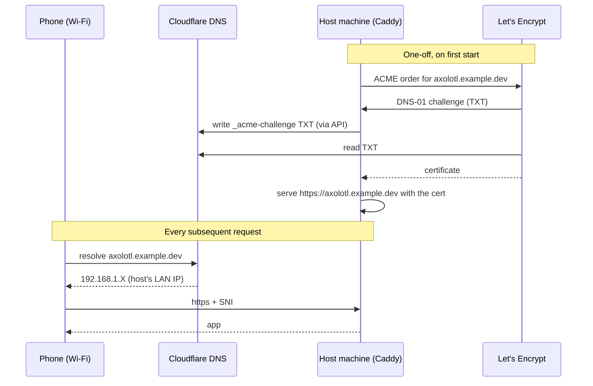
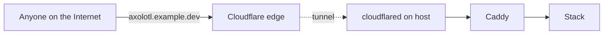

# Deployment

From a fresh clone to a running stack accessible on your phone — three
operating modes, in increasing scope of access.

## Mode 1 — Local desktop only (the default)



What `make dev` gives you out of the box.

```bash
git clone https://github.com/ligne12/axolotl-companion.git
cd axolotl-companion
cp .env.example .env
# Edit .env: HF_TOKEN, JWT_SECRET (openssl rand -hex 32),
# FERNET_KEY (openssl rand -base64 32), AUTH_SECRET (idem), VLLM_MODEL
make dev
```

Open <https://chat.localhost>. Caddy serves a self-signed cert via `tls
internal` — accept once in the browser. The stack is reachable from the
host machine only; nothing is exposed beyond `127.0.0.1`.

This mode requires no DNS, no domain, no firewall rule. It's the
default for `make dev`.

## Mode 2 — LAN access from a phone (HTTPS via DNS-01)



The DNS-01 challenge proves domain ownership through a TXT record
written via the DNS provider's API — Caddy doesn't need to be reachable
from the public Internet. That makes the whole thing work behind any
NAT: no port forwarding, no public IP, no client-side CA install.

### One-time setup

1. **Pick a hostname** under a domain whose DNS lives at Cloudflare
   (move the nameservers if needed — free and instant).

2. **Create a Cloudflare API token** at
   <https://dash.cloudflare.com/profile/api-tokens> with the
   `Edit zone DNS` template, scoped to the relevant zone only. Copy the
   token once — it isn't displayed again.

3. **Add a DNS A record**
   - Type: `A`
   - Name: your sub-domain (e.g. `axolotl`)
   - IPv4: the host's **LAN IP** (the `192.168.x.x` from `ipconfig` /
     `ip addr`)
   - Proxy status: **DNS only** (gray cloud, not orange). The Cloudflare
     proxy can't reach a private IP, so orange would break the setup.

4. **Fill in `.env`** (gitignored, never committed):

   ```dotenv
   APP_HOSTNAMES=axolotl.example.dev,chat.example.dev
   CF_API_TOKEN=<token from step 2>
   AUTH_URL=https://axolotl.example.dev
   NEXTAUTH_URL=https://axolotl.example.dev
   CORS_ORIGINS=http://localhost:3000,https://chat.localhost,https://axolotl.example.dev,https://chat.example.dev
   ```

   `APP_HOSTNAMES` is comma-separated — Caddy issues a single multi-SAN
   cert covering all entries.

5. **Build the proxy image and bring the stack up**. The Caddy upstream
   image doesn't bundle the Cloudflare DNS plugin, so the proxy is
   built locally from `docker/proxy/Dockerfile`:

   ```bash
   make dev      # docker compose up -d --build
   ```

   On first start, Caddy contacts Let's Encrypt, solves the DNS-01
   challenge (~30 s), and persists the cert in the `caddy_data` volume.
   Renewals are automatic.

6. **Reaching the host from the LAN** — platform-specific:

   - **WSL2 on Windows**: Docker publishes `:443` only on `127.0.0.1`
     of the Windows host. Add a port-proxy in Administrator PowerShell:

     ```powershell
     netsh interface portproxy add v4tov6 listenport=443 listenaddress=0.0.0.0 connectport=443 connectaddress=::1
     New-NetFirewallRule -DisplayName "Axolotl HTTPS LAN" -Direction Inbound -LocalPort 443 -Protocol TCP -Action Allow -Profile Private
     ```

   - **Linux / macOS host**: nothing to do — Docker publishes `:443`
     on all interfaces natively.

7. **Test**. Open `https://axolotl.example.dev/` from any device on the
   same Wi-Fi. You should see a green padlock and the login page.

### Troubleshooting

- **Caddy logs `invalidContact ... Domain name does not end with a
  valid public suffix`** — the global `email` directive in the
  Caddyfile uses an invalid TLD. Leave `email` unset (Let's Encrypt
  accepts anonymous registration since 2023).
- **`certificate obtained successfully` but the phone times out** —
  reachability problem, not cert. Verify the WSL port-proxy
  (Windows), and confirm the Cloudflare A record still points at the
  host's current LAN IP (DHCP can rotate it; reserve it in your
  router or use a static config).
- **Cookies don't survive login** — `AUTH_URL` must match the origin
  the user actually browses to, and `AUTH_TRUST_HOST=true` must be set
  for Auth.js v5 to honour the host header.

## Mode 3 — Internet-wide access (Cloudflare Tunnel)

When you want a public link a recruiter can click without you running a
VPS or exposing your home IP:



1. Install `cloudflared` on the host.
2. `cloudflared tunnel login` to authenticate with the same Cloudflare
   account that owns the domain.
3. `cloudflared tunnel create axolotl` — generates credentials for the
   tunnel.
4. Add an ingress rule pointing `axolotl.example.dev` at
   `http://localhost:443` (or `:80` if you want Tunnel to terminate TLS).
5. `cloudflared tunnel route dns axolotl axolotl.example.dev` — registers
   the CNAME automatically.
6. Run `cloudflared` as a service (`systemd` unit / Task Scheduler /
   `launchd`) so the tunnel stays up.

The tunnel terminates TLS at Cloudflare, so the local Caddy can keep
`tls internal` for that hostname. When the host is off, the URL returns
a Cloudflare-managed "origin offline" page rather than a connection
error — graceful for a demo.

If you eventually want **always-on** access without keeping the GPU
machine running, swap to a small VPS that runs the stack against a
remote LLM API (OpenRouter, Together AI, …). The FastAPI backend speaks
OpenAI-compatible HTTP, so it's a `VLLM_API_URL=...` change, not a
refactor.

## Production overrides

`make prod` switches to `compose.prod.yaml`, which:

- Builds backend + frontend in their `production` Docker target (no
  HMR mounts, optimized bundles)
- Uses `uvicorn` with `--workers 4`
- Sets `restart: always` on every service

```bash
make prod
```

For a real deployment, put `.env` somewhere outside the repo and reference
it via `--env-file`, or use Docker secrets / an external orchestrator.
The current production overrides are intentionally minimal — opinionated
hosting choices (TLS termination, scaling, observability) are left to the
operator.
