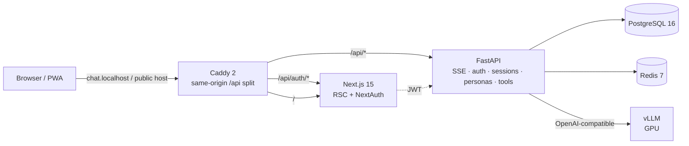
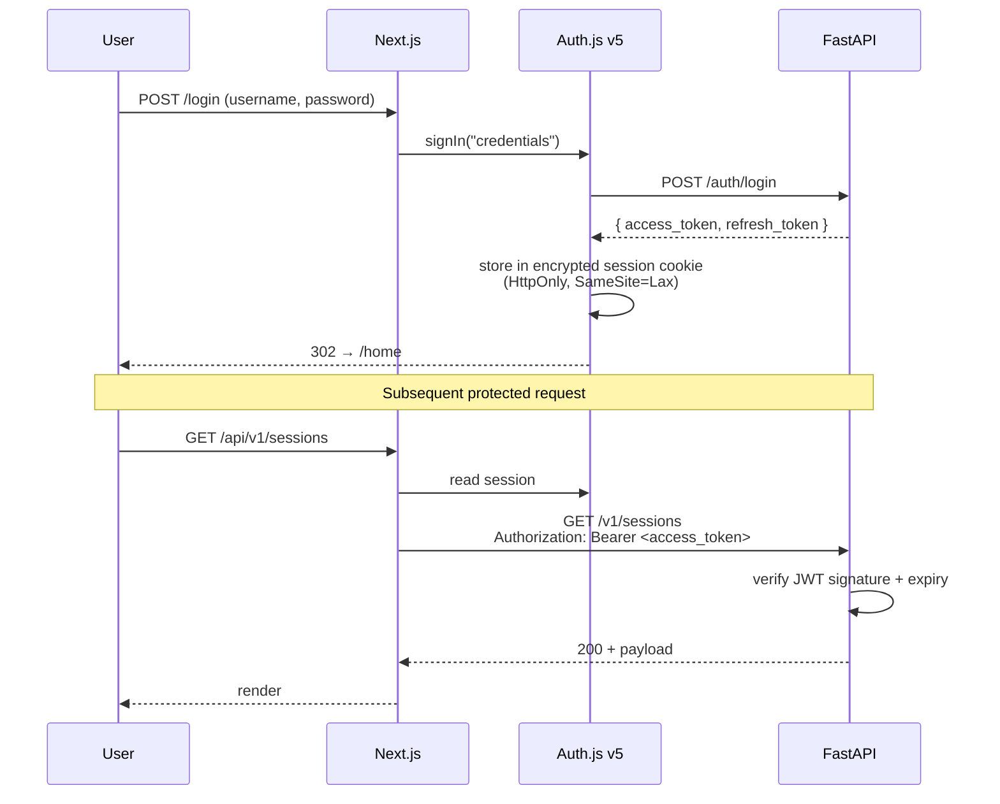
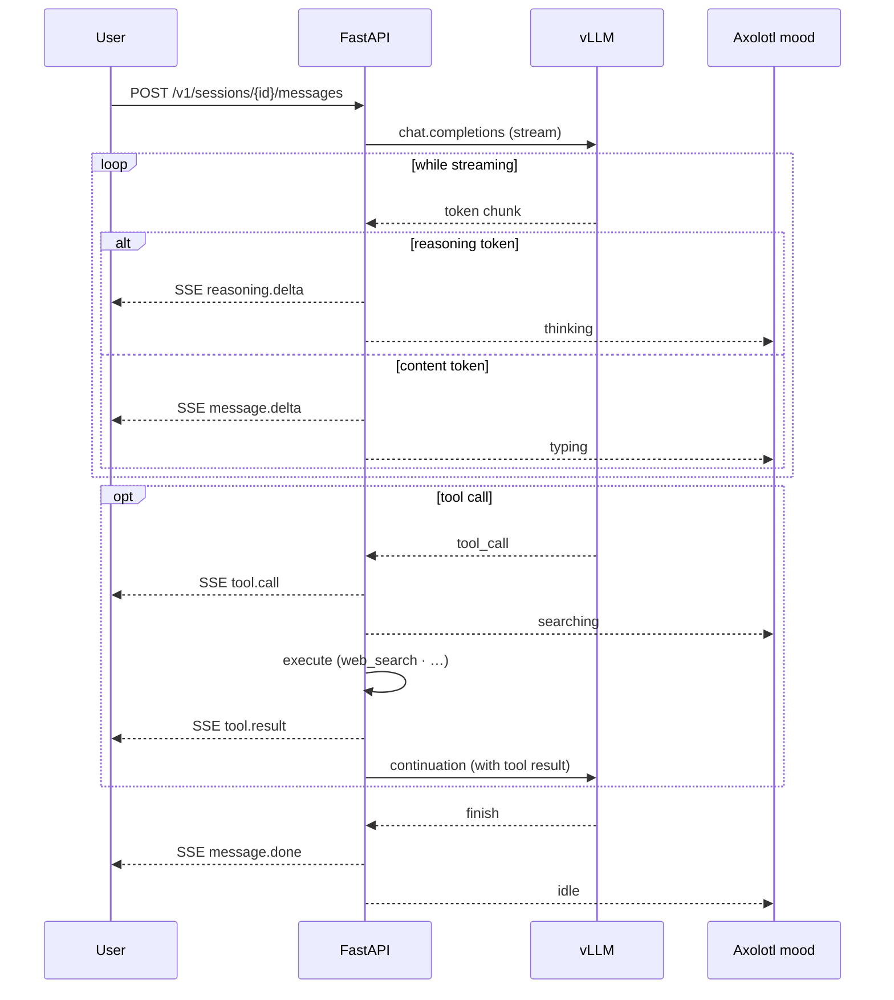
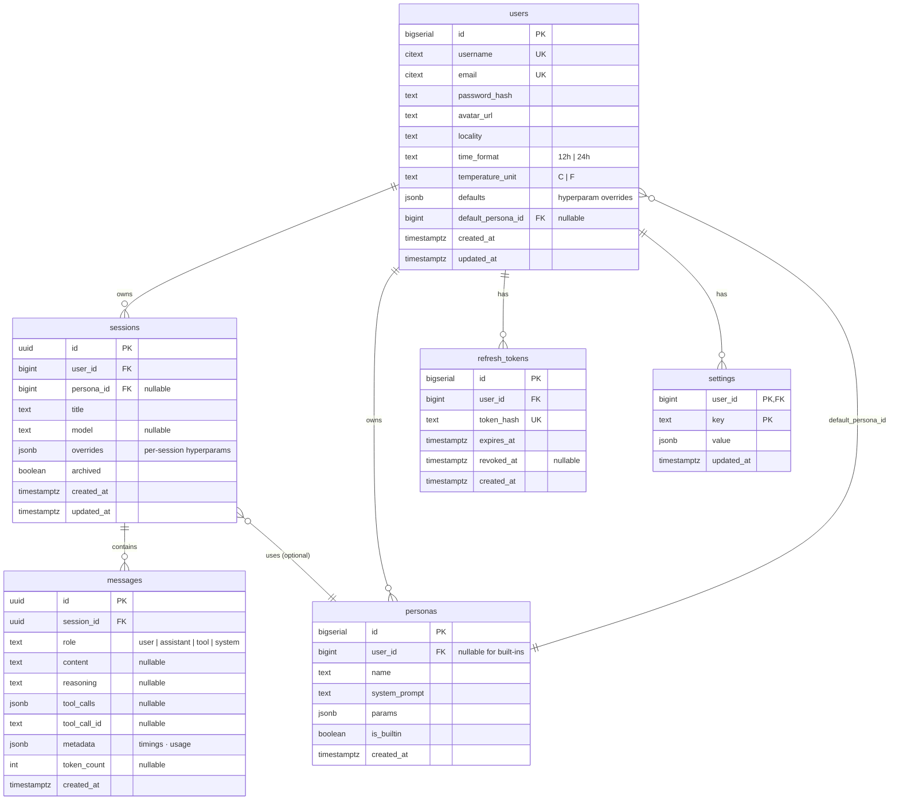

# Axolotl Companion — Development plan

## 1. Vision

A local-first chatbot companion featuring:
- **Private LLM** served via vLLM (model is user-configurable based on the GPU at hand)
- **Animated axolotl sprite** that reacts to internal states (thinking, searching, typing, idle, ...)
- **Tool calling** (web search, weather, date/time)
- **Multi-session chat** with persistent history
- **Responsive PWA** for mobile and desktop
- **100% local by default**, deployable to a VPS or Vercel (frontend) when needed

## 2. Stack

| Layer | Technology |
|---|---|
| LLM serving | vLLM (Docker, GPU) — configurable model |
| Backend | FastAPI + SQLModel + Alembic + uv |
| Database | PostgreSQL 16 |
| Cache | Redis 7 |
| Frontend | Next.js 15 (App Router, RSC) + TypeScript strict |
| Auth | **Auth.js v5** (credentials provider → JWT to FastAPI) |
| UI | Tailwind v4 + Radix UI primitives + custom design system (pixel-neubru) + Framer Motion |
| State | Zustand (client) + TanStack Query (server) |
| Validation | Zod (front) + Pydantic v2 (back) |
| Observability | Prometheus + Grafana + Langfuse (LLM traces) |
| CI/CD | GitHub Actions (lint, test, build, e2e) |
| Quality | Ruff + mypy strict + ESLint + Vitest + Playwright |
| Orchestration | Docker Compose (profiles dev/prod/observability) |
| Proxy | Caddy (automatic TLS in dev via mkcert) |

## 3. Architecture

### Auth flow

### Streaming chat flow

## 4. Database schema (Postgres)

Key indexes: `sessions(user_id, updated_at DESC)`, `messages(session_id, created_at)`,
unique on `users.username`, `users.email`, `refresh_tokens.token_hash`.

## 5. API endpoints

### Auth
- `POST /auth/register`
- `POST /auth/login` → access JWT + refresh token
- `POST /auth/refresh`
- `POST /auth/logout`
- `GET /auth/me`

### Sessions
- `GET /v1/sessions` (paginated list)
- `POST /v1/sessions` (new conversation)
- `POST /v1/sessions/{id}/messages` → SSE stream
  - Events: `message.start`, `reasoning.delta`, `message.delta`, `tool.call`, `tool.result`, `message.done`, `error`
- `GET /v1/sessions/{id}` (detail + messages)
- `PATCH /v1/sessions/{id}` (rename, archive)
- `DELETE /v1/sessions/{id}`

### Personas
- `GET /v1/personas`
- `POST /v1/personas`
- `PATCH /v1/personas/{id}`
- `DELETE /v1/personas/{id}`

### Settings
- `GET /v1/settings`
- `PUT /v1/settings` (batch update)

### Export / backup
- `GET /v1/export/sessions/{id}` → downloadable JSON
- `POST /v1/import/sessions` → upload JSON

## 6. Development phases

### Phase 0 — Repo setup ✅ done
- Directory structure, base Compose, Dockerfiles, CI skeleton, README, license
- Dockerised vLLM (model configurable via env vars)

### Phase 1 — Backend MVP ✅ done
- FastAPI + Pydantic Settings config
- Postgres + Alembic + SQLModel (multiple migrations shipped)
- Auth: JWT + bcrypt + rotating refresh tokens
- Sessions CRUD + authz
- Chat SSE endpoint wrapping vLLM with tool calling
- Extensible tool registry + per-user enable/disable via `/v1/tools`
- Personas CRUD (`/v1/personas`)
- User profile CRUD (`/auth/me` PATCH) with locality + display preferences
- User-level hyperparam defaults + per-session overrides (JSONB)
- Default persona pin per user (`users.default_persona_id`)
- Unit + integration tests (pytest, NullPool for asyncio stability)

### Phase 2 — Frontend MVP ✅ done
- Next.js 15 (App Router, RSC) + Tailwind v4 + Radix UI primitives
- Auth.js v5 credentials provider, login / register pages
- Chat UI: messages, input, tool-call cards (web search rendered with
  result thumbnails + duration), reasoning blocks, `useChat` hook over SSE
- Cmd+K command palette + keyboard-shortcut overlay
- Cmd+, in-conversation controls drawer (persona / model / hyperparams /
  reasoning, all per-session)
- Types auto-generated from OpenAPI; `make check-api-types` enforces drift in CI
- Custom design language (pixel-neubru) — warm cream paper, 2 px ink
  borders, electric-lime accent, ClashDisplay italic accents, Pixelify
  Sans labels
- `/dev/components` living sandbox to preview every primitive
- Sonner toasts retailored to the design language
- Mobile polish pass — responsive base font-size, sticky save bars,
  weather pill compacted, markdown tables scroll horizontally instead of
  pushing the bubble past the viewport

### Phase 3 — Animated axolotl ✅ done (different shape than planned)
- ✅ Mood reactivity on the home hero
- ✅ Blender-authored ``axolotl-chibi.glb`` driven by Three.js +
  ``GLTFLoader`` + ``AnimationMixer``; seven NLA clips (idle /
  listening / thinking / searching / typing / happy / confused) with a
  300 ms crossfade between moods. ``Axolotl3D`` is lazy-loaded with
  the SVG sprite as the SSR + reduced-motion fallback.
- ✅ Seven-state derivation lives in ``home-hero``, driven by the
  ``chat-status`` store (``lastError``, ``currentTool``, ``isSending``,
  ``tokensPerSec``, ``justFinished``, ``pokedUntil``). No external
  state-machine library — the rules are linear enough that a plain
  reducer reads more clearly than XState here.
- ✅ Pixel-art mood emblems (thought bubble, magnifier, hearts, ``?``,
  listening dashes) overlay the canvas so the state reads at the same
  glance as the SVG sprite-sheet reference.

### Phase 4 — Polish 🚧 in progress
- ✅ Settings UI:
  - **Profile** — username, locality (feeds the terminal footer's `LOCAL`
    tag, e.g. `● LOCAL · MONTPELLIER`), time format (12h / 24h),
    temperature unit (°C / °F)
  - **Personas** — full CRUD, markdown system-prompt bodies, default-pin,
    "Start as persona" entry in the command palette
  - **Model** — global hyperparam defaults via DA-styled range sliders
    (temperature, top_p, top_k, min_p, presence_penalty,
    repetition_penalty, max_tokens), per-slider clear-override + global
    reset
  - **Reasoning** — three-choice radio (on / off / server default) for
    `enable_thinking`
  - **Tools** — per-user enable/disable (foundation for MCP later)
- ✅ Dark / light theming (system follow + manual toggle)
- ✅ **Real HTTPS, opt-in** (out-of-plan addition) — public hostname
  served with a Let's Encrypt cert via DNS-01 (Cloudflare DNS plugin),
  works behind NAT, no public IP, no client-side CA install. Activated
  by `APP_HOSTNAMES` + `CF_API_TOKEN` in `.env`.
- ✅ **Mobile polish pass** (out-of-plan addition) — responsive base
  density, sticky save bars on Settings, weather pill compact rendering,
  markdown table horizontal scroll, chat input fits narrow widths
- ✅ PWA (Serwist) — manifest + theme colours + custom-build service
  worker (`@serwist/next`) with NetworkOnly bypass on `/api/*`, SVG icons
  in the design language, installable on home screen
- ✅ **MCP servers CRUD** — per-user records (id, name, url, transport
  ``http``, Fernet-encrypted bearer token, enabled flag) + CRUD
  endpoints + ``POST /sync``. Tools encoded as
  ``mcp__<server_id>__<name>``, dispatched through the orchestrator
  alongside built-ins. The MCP client speaks the proper
  ``initialize`` + ``Mcp-Session-Id`` handshake and parses
  ``text/event-stream`` JSON-RPC responses (verified against Context7
  + DeepWiki). Result text is capped at 12 k chars before re-entering
  the prompt so a chatty tool can't blow the KV cache.
  Settings → MCP page (cards, modal CRUD, sync state with inline CTA on
  ``never synced`` / ``sync failed``) + Tools page grouped by
  provenance (built-in vs per-server). Chat renders a dedicated MCP
  card for ``mcp__*`` tool calls — args in a collapsible details, MCP
  content blocks (text / image / resource) inline.
  Deferred to a follow-up iteration:
    - OAuth flows (only static bearer token in MVP)
    - Auto-reconnect / periodic health-check (sync is manual)
    - Streaming tool results (MCP tools return one object per call)
    - ``stdio`` transport (security risk — server would spawn arbitrary
      local processes)
- ✅ **i18n FR / EN** — ``next-intl`` 3.x, cookie-based locale
  (``axo-locale``, no URL prefix), ``Accept-Language`` fallback. Single
  source of truth in ``src/i18n/config.ts``; messages live under
  ``messages/<code>.json`` with ICU plurals, ``t.rich`` for ``<em>`` /
  ``<code>`` / ``<kbd>`` / ``<link>`` tags. Sidebar, Settings (all six
  tabs), Auth pages, chat input + controls drawer, sampling sliders
  (param labels looked up via ``params.<key>``), home hero + recent
  sessions all translated. Locale switcher pinned next to the theme
  toggle in the sidebar footer.
- 📋 Export / import conversations (JSON)

### Phase 5 — Observability + docs polish 📋
- Prometheus + Grafana dashboards (services scaffolded in compose, dashboards
  pending)
- Langfuse LLM traces
- Polished README (demo GIF, diagrams, badges) — partially shipped
- Deployment guides (local, Cloudflare Tunnel, VPS)

## 7. Hosting

**Supported modes (documented in README):**

| Mode | Command | Notes |
|---|---|---|
| Local dev | `make dev` | Compose with HMR, local Postgres |
| Local prod | `make prod` | Optimised Compose, single machine |
| VPS | `docker compose -f compose.prod.yaml up -d` | Caddy TLS, secrets via `.env` |
| Vercel (frontend only) | `vercel deploy` | Backend hosted separately (VPS or Railway) |
| Railway | `railway up` | Full stack managed |

## 8. Conventions

- **Conventional Commits** (`feat:`, `fix:`, `docs:`, `chore:`, ...)
- **Branches**: `main` (prod), `dev` (integration), `feat/*`, `fix/*`
- **PRs**: template with CI checklist and UI screenshots
- **ADRs** live in `docs/adr/`. Reference docs (auth, database, api,
  chat, features, deployment, models) live in `docs/` root
- **SemVer** + generated `CHANGELOG.md`

## 9. Security checklist

- [x] bcrypt for passwords (direct `bcrypt` lib, not `passlib`)
- [x] Short-lived JWT (15 min access) + rotating refresh tokens (hashed at rest)
- [x] Restrictive CORS (origin whitelist from `CORS_ORIGINS`)
- [x] Rate limiting (slowapi + Redis) — `5/hour` register, `10/min`
      login, `30/min` refresh; opt-in per route, in-memory fallback in
      tests
- [x] CSP headers in Next.js (`next.config.ts`) — same-origin script,
      Tailwind/Radix inline styles, `data:`/`blob:` images, Google
      Fonts host, `frame-ancestors 'none'`
- [ ] Secrets never committed (pre-commit hook) — manual review only
- [x] Third-party tokens (MCP bearer, etc.) encrypted at rest in DB
      (Fernet via `core/secrets.py`)
- [x] Trivy image scans in CI (SARIF → GitHub Code-scanning,
      `severity: CRITICAL,HIGH`, `ignore-unfixed`)
- [x] Dependabot enabled (`Dependabot Updates` runs visible in CI)
- [x] HTTPS in prod (Caddy auto TLS — local trust on `*.localhost`,
      Let's Encrypt + DNS-01 on public hostnames)
