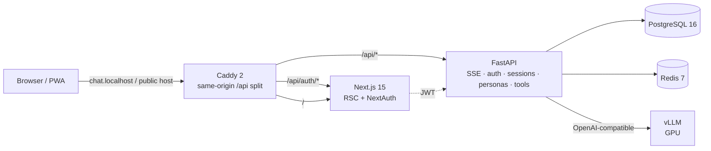
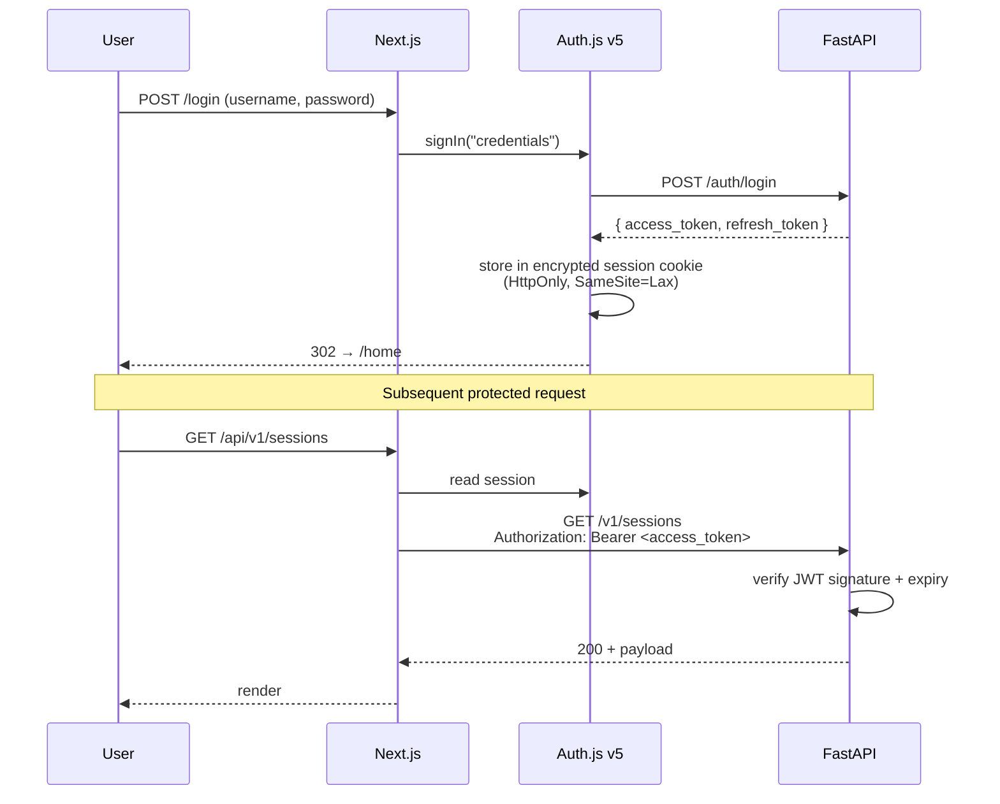
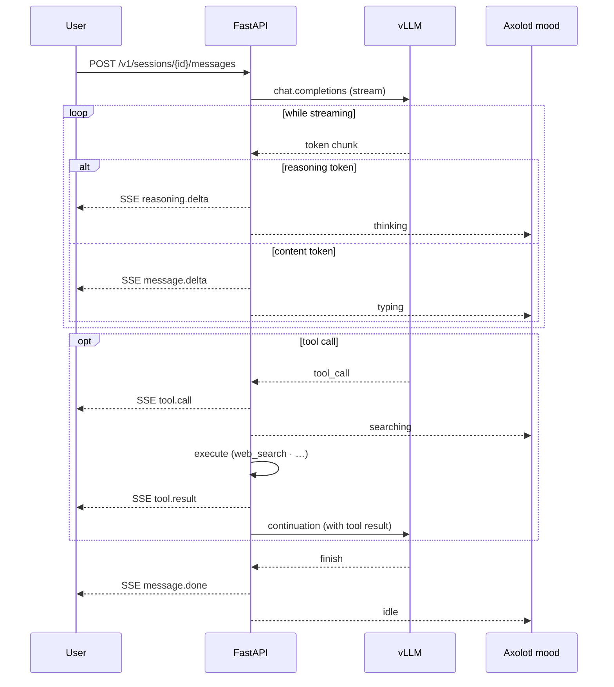
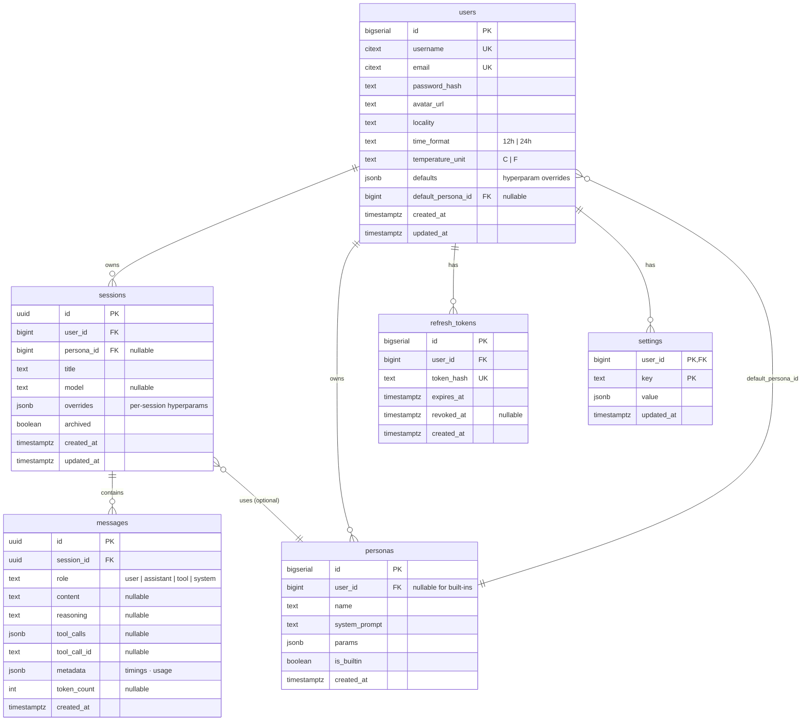

# Axolotl Companion — Development plan

## 1. Vision

A local-first chatbot companion featuring:
- **Private LLM** served via vLLM (model is user-configurable based on the GPU at hand). The orchestrator + parsers are built around the **Qwen3.5 architecture** (`qwen3` reasoning parser, `qwen3_coder` tool-call parser); other families slot in by changing the vLLM flags — see [`docs/models.md`](docs/models.md).
- **Animated axolotl sprite** that reacts to internal states (thinking, searching, typing, idle, ...)
- **Tool calling** (web search, weather, date/time)
- **Multi-session chat** with persistent history
- **Responsive PWA** for mobile and desktop
- **100% local by default**, deployable to a VPS or Vercel (frontend) when needed

## 2. Stack

| Layer | Technology |
|---|---|
| LLM serving | vLLM (Docker, GPU) — configurable model |
| Backend | FastAPI + SQLModel + Alembic + uv |
| Database | PostgreSQL 16 |
| Cache | Redis 7 |
| Frontend | Next.js 15 (App Router, RSC) + TypeScript strict |
| Auth | **Auth.js v5** (credentials provider → JWT to FastAPI) |
| UI | Tailwind v4 + Radix UI primitives + custom design system (pixel-neubru) + Framer Motion |
| State | Zustand (client) + TanStack Query (server) |
| Validation | Zod (front) + Pydantic v2 (back) |
| Observability | Prometheus + Grafana + Langfuse (LLM traces) |
| CI/CD | GitHub Actions (lint, test, build, e2e) |
| Quality | Ruff + mypy strict + ESLint + Vitest + Playwright |
| Orchestration | Docker Compose (profiles dev/prod/observability) |
| Proxy | Caddy (automatic TLS in dev via mkcert) |

## 3. Architecture

### Auth flow

### Streaming chat flow

## 4. Database schema (Postgres)

Key indexes: `sessions(user_id, updated_at DESC)`, `messages(session_id, created_at)`,
unique on `users.username`, `users.email`, `refresh_tokens.token_hash`.

## 5. API endpoints

### Auth
- `POST /auth/register`
- `POST /auth/login` → access JWT + refresh token
- `POST /auth/refresh`
- `POST /auth/logout`
- `GET /auth/me`

### Sessions
- `GET /v1/sessions` (paginated list)
- `POST /v1/sessions` (new conversation)
- `POST /v1/sessions/{id}/messages` → SSE stream
  - Events: `message.start`, `reasoning.delta`, `message.delta`, `tool.call`, `tool.result`, `message.done`, `error`
- `GET /v1/sessions/{id}` (detail + messages)
- `PATCH /v1/sessions/{id}` (rename, archive)
- `DELETE /v1/sessions/{id}`

### Personas
- `GET /v1/personas`
- `POST /v1/personas`
- `PATCH /v1/personas/{id}`
- `DELETE /v1/personas/{id}`

### Settings
- `GET /v1/settings`
- `PUT /v1/settings` (batch update)

### MCP servers
- `GET /v1/mcp/servers` / `POST /v1/mcp/servers`
- `GET /v1/mcp/servers/{id}` / `PATCH` / `DELETE`
- `POST /v1/mcp/servers/{id}/sync` — fetch the server's `tools/list`, persist

### Observability
- `GET /metrics` — Prometheus scrape (HTTP counters + custom chat / tool / MCP signal)

## 6. What's shipped

Everything below is in main, runs locally via `make dev`, and has CI
green (backend ruff + format + mypy strict + pytest, frontend `tsc
--noEmit` + ESLint, Docker build + Trivy SARIF). The phase log lives in
git history; this section is the surface-level recap.

**Inference & tooling.** vLLM (configurable via `VLLM_MODEL`,
architecturally aligned with Qwen3.5 — see §2), SSE chat with
reasoning + tool-call rounds, extensible built-in tool registry
(`web_search` shipped) + per-user toggle. The context window /
concurrency / utilisation knobs are tuned against an explicit memory
budget — the math + tuning rules of thumb are in
[`docs/models.md` § Memory budget primer](docs/models.md#memory-budget-primer)
(targets ≈ 85-92 % GPU utilisation, ≤ 80 % of theoretical KV-cache
budget for `max_model_len × max_num_seqs`, fp8 KV by default,
chunked prefill on so big prompts don't OOM mid-forward). **MCP servers
CRUD** with Fernet-encrypted bearer tokens, full
`initialize`/`Mcp-Session-Id` handshake, `text/event-stream` JSON-RPC
parsing, 12 k-char result cap before re-injection. Dedicated chat
card for `mcp__*` tool calls.

**Backend.** FastAPI + SQLModel + Alembic on Postgres 16, Redis 7,
Auth.js v5 ↔ FastAPI JWT with rotating refresh tokens hashed at rest,
slowapi per-IP rate limits on the auth endpoints. Personas CRUD with
default-pin, user-level hyperparam defaults + per-session overrides,
locality / time-format / temperature-unit preferences. Pydantic v2,
structlog, pytest with NullPool.

**Frontend.** Next.js 15 App Router (RSC + Auth.js v5), Tailwind v4
+ Radix primitives + custom pixel-neubru design language, Cmd+K
palette, Cmd+, controls drawer (persona / model / hyperparams /
reasoning, per-session), full mobile polish, **PWA** (Serwist —
NetworkOnly on `/api/*` + on every navigation), **FR / EN i18n**
(`next-intl` with cookie-based locale, ICU plurals, locale-aware
relative time). OpenAPI → TS types pipeline with drift enforced in CI.

**Mascot.** Blender-authored `axolotl-chibi.glb` driven by Three.js +
`GLTFLoader` + `AnimationMixer`; seven NLA clips (idle / listening
/ thinking / searching / typing / happy / confused) with a 300 ms
crossfade. Seven-state derivation in `home-hero` from the
`chat-status` store. The chibi reads its state through the body
animation alone — no overlay glyphs. A sized neutral tile fills the
slot during SSR / first-load before the Three.js bundle hydrates.

**Networking.** Caddy 2 (custom build with the
`caddy-dns/cloudflare` plugin) — `tls internal` on `*.localhost` for
dev, Let's Encrypt via **DNS-01** on a public hostname for opt-in
remote access (works behind NAT / CGNAT, no port-forwarding, no
client-side CA install).

**Observability.** Prometheus instrumentator on FastAPI (`/metrics`)
+ custom signal (`axolotl_chat_streams_total{outcome}`,
`axolotl_chat_stream_duration_seconds`, `axolotl_tool_calls_total{tool,
outcome}`, `axolotl_mcp_syncs_total{outcome}`), Grafana provisioned
from `docker/grafana/provisioning/` (10-panel *Axolotl — overview*
board behind the `obs` Compose profile), **Langfuse** traces wrapping
each chat round + tool call (no-op when secrets are blank).

**Security.** CSP headers (prod / dev splits), CORS allowlist from
env, slowapi rate limiting, Fernet for third-party tokens at rest,
Trivy image scans uploading SARIF to GitHub Code-scanning, Dependabot.

## 7. Future explorations

The shipped surface above is the intended scope. This section is a
deliberate parking-lot, not a commitment. Each entry is sized as a
self-contained slice — pick the one that excites, ship it as a
follow-up.

### 7.1 Chibi-in-conversation

The mascot already exists in the home hero. Pull it into the chat
itself so the seven moods read continuously while messages flow,
instead of being hero-only chrome.

- **Where it sits.** Small persistent ``Axolotl3D`` pinned to the
  chat composer's left side (above the input on mobile, to the side
  on desktop). Same canvas, same lazy-loaded bundle. Long press →
  hides it for the session for users who want a quieter UI.
- **What it reacts to.** Same store as the hero, plus a few
  conversation-level signals:
    - User message *just sent* → ``listening`` (≤ 800 ms)
    - First reasoning token → ``thinking``
    - First content token → ``typing``
    - Tool call start → ``searching`` (or a per-category clip if we
      grow the bank: ``digging`` for code, ``reading`` for docs…)
    - ``message.done`` with non-zero usage → brief ``happy`` flourish
    - SSE ``error`` event → ``confused`` flash (auto-clears after 3 s)
    - 60 s of no activity → ``idle`` with a periodic blink/yawn
      (new NLA clip — out of the seven, "idle-rest")
- **What it remembers.** A lightweight session "energy" counter in
  ``chat-status`` decays slowly:
    - +1 on each successful round
    - −2 on each error / retry
  Once it crosses thresholds, the idle clip changes (perky vs.
  tired). Session-scoped, never persisted, reset on new chat.
- **Assistant-bubble micro-reactions.** Stretch idea: persist the
  mood the axolotl was in when each assistant message landed on
  ``messages.metadata.mood`` and render a tiny pixel-art glyph next
  to the bubble header (28 px). Reading back a conversation, you
  see the axolotl's "trace" without spinning up a 3D canvas per
  message.
- **Cost.** ~3 days. No new infra. New Blender clip ("idle-rest"
  with a yawn + blink) is the only asset work; everything else is
  wiring the store to the chat shell + a small per-message snapshot.

### 7.2 RAG memory (⭐ keep)

A user-curated, embedding-backed memory that the orchestrator pulls
into context at chat start.

- pgvector on Postgres 16 (no new DB), a sidecar embeddings service
  (HuggingFace `text-embeddings-inference` with
  `multilingual-e5-small` — ~100 MB, CPU).
- Star ⭐ on assistant bubbles → ``POST /v1/memories``. New
  ``Settings → Memory`` page lists / searches / deletes / tags.
- ``orchestrator.stream_chat`` does a top-K cosine retrieval on the
  most recent user message, injects a ``Relevant memories from past
  conversations:`` system block when matches clear a threshold.
- Same plumbing covers **file attachments** (drop a PDF → embed
  chunks → tag with the session id, retrieved alongside ⭐ memories).
- A new mascot mood — ``recalling`` — fires when the retrieval hits.

### 7.3 Multimodal vision

vLLM accepts ``image_url`` content blocks out of the box; the
question is *which* model carries the vision encoder. Two paths
worth weighing:

- **Stay on Qwen3.5-9B, drop the text-only flag.** The current
  ``VLLM_EXTRA_FLAGS`` ships ``--language-model-only`` precisely to
  skip the vision encoder and free its weights for KV cache. Remove
  that flag and the same model handles both text and images, no
  weights swap. Trade-off: lose a chunk of context budget (the
  vision encoder + extra activation buffers eat ~2 GB on a 16 GB
  card) — drop ``VLLM_MAX_MODEL_LEN`` from 64 K to 16-24 K to keep
  headroom. Best path for a *companion* that occasionally needs
  vision.
- **Hot-swap to a vision-first model when you need OCR /
  document Q&A.** [`zai-org/GLM-OCR`](https://huggingface.co/zai-org/GLM-OCR)
  is the obvious candidate — small, OCR-tuned, AWQ-friendly. Pair
  with a per-session ``model`` override (already in `Session.model`)
  so the user can promote a chat to "vision mode" without touching
  the global default.

Frontend work in both cases: a paste-image / drag-and-drop affordance
on the chat composer, an upload endpoint that returns a same-origin
URL, and an ``image_url`` parameter type in the tool registry so
future built-ins (OCR, image-search, …) can ingest images too.

### 7.4 Conversation branching

Sometimes you want to retry an answer without losing the original.

- ``sessions.parent_session_id`` + ``branched_at_message_id``.
- Hover an assistant bubble → "fork from here" → spawns a new
  session pre-filled with messages up to that point, attached to
  the source in the sidebar (collapsible tree).
- Cheap on Postgres (messages copied lazily on first send), great
  UX win for experimentation.

### 7.5 Persona evolution

Personas are static system prompts today. Two opt-in extensions:

- **Auto-tags.** After each chat, classify the convo into 2-3 tags
  (topic, register, sentiment) using the same vLLM. Surfacing those
  in Settings → Personas lets you see which personas are getting
  used for what.
- **Drift.** A persona can opt in to a "preference buffer" that
  appends short user-confirmed style notes ("be terser", "more code
  comments"). Buffer is editable, capped at N entries, prepended to
  the system prompt at the next chat start.

### 7.6 Export / import conversations

The one punch-list item from the original plan that didn't land —
kept on the parking-lot for completeness. Postgres dumps already
cover backups, so this is pure UX:

- ``GET /v1/export/sessions/{id}`` → JSON (session + messages +
  attached persona + overrides).
- ``POST /v1/import/sessions`` → re-create as a fresh session for
  the importing user.

### 7.7 Daily brief agent

A cron-driven companion ritual: every morning the axolotl runs a
handful of MCP / built-in tools and lands a fresh "daily brief"
session in the sidebar waiting for the user.

- New table ``scheduled_jobs`` (user_id, cron_expr, prompt template,
  enabled, last_run_at) + a backend worker (APScheduler or a simple
  asyncio loop on top of Redis) that fires entries on schedule.
- The job triggers a normal ``stream_chat`` flow against a pre-built
  prompt ("summarise my GitHub notifications, Slack DMs, and the
  weather"), uses the user's MCP servers + built-in tools, and
  persists the result as the first message of a new session named
  ``Brief — {date}``.
- Settings → Schedules page to manage them — cron picker, prompt
  textarea, "run now" button.

### 7.8 Pin & widgets

Turn any assistant message into a persistent card on ``/home``.
Recipe, TODO, code snippet — the axolotl becomes a light dashboard.

- New ``pinned_messages`` join table (user_id, message_id, title,
  layout slot, expires_at?).
- Hover an assistant bubble → "📌 Pin to home" → modal with a
  one-line title.
- ``/home`` grows a "Pinned" section below the hero, rendering each
  card with the message's markdown body, an unpin button, and a
  "jump to source" link.
- Same plumbing supports **session-scoped sticky messages** later
  (e.g. system reminders the model emits to itself).

### 7.9 Chat search (full-text + semantic)

Re-uses the embeddings sidecar from §7.2 RAG memory. Two channels
combined, ranked together:

- Postgres ``tsvector`` on ``messages.content`` for BM25 keyword
  hits (covers exact terms, file names, error messages).
- ``pgvector`` cosine on the same embeddings table for semantic
  hits ("the convo where I asked about Caddy DNS-01").
- New endpoint ``GET /v1/search/messages?q=...&k=20`` returns hits
  with session id + message excerpt + score breakdown.
- Cmd+K palette gains a "Search messages…" mode (full-window
  results pane, jump to source on enter).

### 7.10 Built-in tool registry — second wave

Today the registry ships a single tool (``web_search``). Seven more
fit the companion theme without standing up new infra. Each is a
self-contained ``BaseTool`` subclass under
``backend/src/axolotl/llm/tools/`` and a single line in the
registry; sized roughly so the whole batch is one focused PR
(~1 dev-day if grouped, ~2 h apiece on their own):

- **``get_weather``** — Open-Meteo (no API key, free). Defaults to
  the user's ``profile.locality`` so the model can react to the
  forecast without being asked ("it's raining — want a film
  suggestion?"). ~2 h.
- **``fetch_url``** — ``httpx`` + readability-lxml, returns the
  cleaned plain-text body of a page. A real upgrade over
  ``web_search`` — today the model only sees DuckDuckGo snippets,
  here it can dig into one page. Allow-list of safe schemes
  (``http``, ``https``) + a request-time cap. ~3 h.
- **``current_time``** — current local time, timezone conversion,
  diff calculation. Pairs with the user's ``time_format``
  preference. Trivial (~1 h) but the model needs it more often
  than people expect ("how long until Christmas", "what's 09:00
  Paris in Tokyo").
- **``calculator``** — ``sympy`` for symbolic eval, with a sandboxed
  ``simpleeval`` fallback for plain arithmetic. The model is bad at
  4-digit additions; this delegates cleanly. ~2 h.
- **``wikipedia_search``** — structured results (title + summary +
  canonical URL) via the official MediaWiki API. Much cleaner than
  DuckDuckGo for encyclopaedic knowledge. ~2 h.
- **``reminder``** — "rappelle-moi X demain à 14h" → inserts a row
  in a new ``reminders`` table; an internal cron fires an SSE
  ``reminder.due`` event back into the right session when the time
  comes. The most *companion* of the lot. ~1 day.
- **``recall_memory``** — once §7.2 RAG ships, expose retrieval as
  an explicit tool too: the model can decide to fetch on demand
  rather than wait for the automatic pre-prompt injection. ~30 min
  behind §7.2.

## 8. Hosting

**Supported modes (documented in README):**

| Mode | Command | Notes |
|---|---|---|
| Local dev | `make dev` | Compose with HMR, local Postgres |
| Local prod | `make prod` | Optimised Compose, single machine |
| VPS | `docker compose -f compose.prod.yaml up -d` | Caddy TLS, secrets via `.env` |
| Vercel (frontend only) | `vercel deploy` | Backend hosted separately (VPS or Railway) |
| Railway | `railway up` | Full stack managed |

## 9. Conventions

- **Conventional Commits** (`feat:`, `fix:`, `docs:`, `chore:`, ...)
- **Branches**: `main` (prod), `dev` (integration), `feat/*`, `fix/*`
- **PRs**: template with CI checklist and UI screenshots
- **ADRs** live in `docs/adr/`. Reference docs (auth, database, api,
  chat, features, deployment, models) live in `docs/` root
- **SemVer** + generated `CHANGELOG.md`

## 10. Security checklist

- [x] bcrypt for passwords (direct `bcrypt` lib, not `passlib`)
- [x] Short-lived JWT (15 min access) + rotating refresh tokens (hashed at rest)
- [x] Restrictive CORS (origin whitelist from `CORS_ORIGINS`)
- [x] Rate limiting (slowapi + Redis) — `5/hour` register, `10/min`
      login, `30/min` refresh; opt-in per route, in-memory fallback in
      tests
- [x] CSP headers in Next.js (`next.config.ts`) — same-origin script,
      Tailwind/Radix inline styles, `data:`/`blob:` images, Google
      Fonts host, `frame-ancestors 'none'`
- [x] Secrets never committed — `gitleaks` + `detect-private-key` in
      `.pre-commit-config.yaml`, **enforced in CI** via the
      `Pre-commit` workflow (runs on every push and PR)
- [x] Third-party tokens (MCP bearer, etc.) encrypted at rest in DB
      (Fernet via `core/secrets.py`)
- [x] Trivy image scans in CI (SARIF → GitHub Code-scanning,
      `severity: CRITICAL,HIGH`, `ignore-unfixed`)
- [x] Dependabot enabled (`Dependabot Updates` runs visible in CI)
- [x] HTTPS in prod (Caddy auto TLS — local trust on `*.localhost`,
      Let's Encrypt + DNS-01 on public hostnames)
